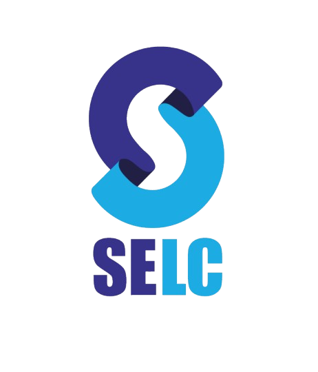

# SELC - Smart English Learning Center



## Table of Contents

- [Introduction](#introduction)
- [Features](#features)
- [Getting Started](#getting-started)
  - [Prerequisites](#prerequisites)
  - [Installation](#installation)
- [Usage](#usage)
- [Architecture](#architecture)
- [Dependencies](#dependencies)
- [Contributing](#contributing)
- [License](#license)

## Introduction

SELC (Smart English Learning Center) is a comprehensive Flutter application designed to facilitate English language learning. It provides a platform for students to access courses, playlists, updates, and manage their enrollment. The app also includes an admin interface for managing content and student data.

## Features

- User Authentication (Firebase Auth)
- Course Management
- Video Playlists
- Student Enrollment System
- Updates and Announcements
- Admin Dashboard
- Analytics Integration
- Dark Mode Support
- Responsive Design

## Getting Started

### Prerequisites

- Flutter SDK (^3.5.2)
- Dart SDK (^3.5.2)
- Firebase account and project setup

### Installation

1. Clone the repository:

   ```
   git clone https://github.com/wasim-zaman/selc.git
   ```

2. Navigate to the project directory:

   ```
   cd selc
   ```

3. Install dependencies:

   ```
   flutter pub get
   ```

4. Set up your Firebase configuration:

   - Create a new Firebase project
   - Add your `google-services.json` (for Android) and `GoogleService-Info.plist` (for iOS) to the respective directories
   - Update the Firebase configuration in the app

5. Run the app:
   ```
   flutter run
   ```

## Usage

- Students can browse courses, watch video playlists, and view updates
- Admins can manage courses, playlists, student enrollments, and app content
- The app supports both light and dark modes for comfortable viewing

## Architecture

SELC uses the BLoC (Business Logic Component) pattern for state management. The project structure is organized as follows:

- `lib/`
  - `models/`: Data models
  - `services/`: API and backend services
  - `view/`: UI components and screens
  - `utils/`: Utility functions and constants
  - `cubit/`: BLoC/Cubit state management

## Dependencies

SELC relies on several key dependencies:

For a complete list of dependencies, please refer to the `pubspec.yaml` file.

## Contributing

Contributions to SELC are welcome! Please follow these steps:

1. Fork the repository
2. Create a new branch: `git checkout -b feature/your-feature-name`
3. Make your changes and commit them: `git commit -m 'Add some feature'`
4. Push to the branch: `git push origin feature/your-feature-name`
5. Submit a pull request

## License

This project is licensed under the [MIT License](LICENSE).

---

Developed with ❤️ by Sairatec-Solutions
# qr_code_app_nartec
